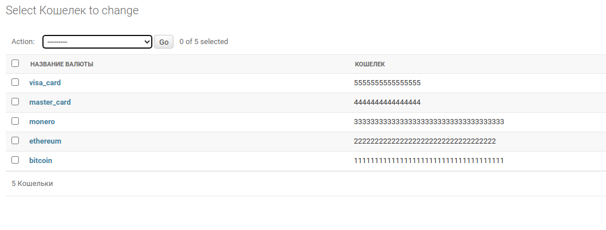

# Подмена кошельков и карт на сервисах секретных записок: onetimesecret, 1ty

## Инструкция по запуску

### 1. ```sudo su```
### 2. ```python3 -m venv venv```
### 3. ```source venv/bin/activate```
### 4. ```pip install -r requirements.txt```
### 5. ```bash install.sh```
### 6. ```python3 manage.py createsuperuser```
### 7. ```python3 manage.py runserver```
### 8. Логинимся на ```http://127.0.0.1:8000/admin```. 
### Переходим во вкладку "ONETIMESECRET" -> "Кошельки", и добавляем свои кошельки по примеру:

### 

## Тестировалась на ubuntu 20.04
# ClipperNotes
